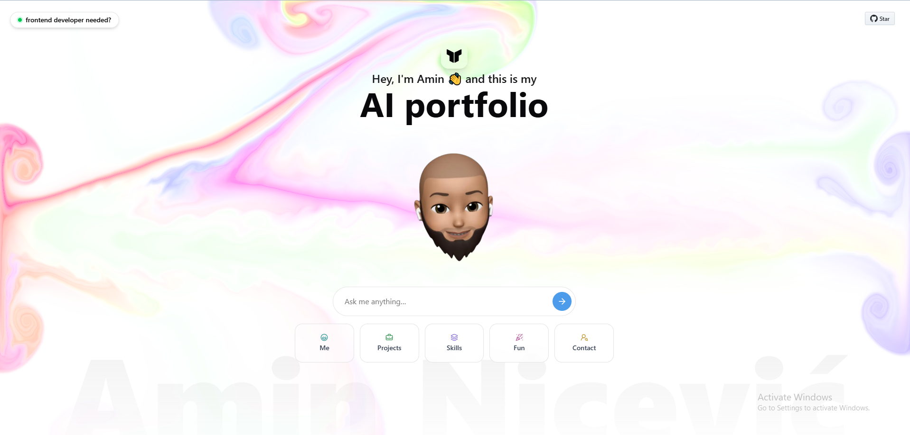

  

# 🧠 AI Portfolio – Your Conversation-Driven Resume

**Static portfolios are dead.**  
Meet **AI Portfolio** – an interactive experience that adapts to *you*.

> Instead of scrolling, start a conversation.  
> My AI avatar answers your questions in real-time — just like I would.

---

## 💬 What can you ask?

Whether you're a recruiter, a dev, or just curious — you're welcome to explore:

- 🧑‍💼 **Tech Recruiter?**  
  Ask about my tech stack, experience, and results.

- 👨‍💻 **Developer?**  
  Dive deep into my projects, code, and technical decisions.

- 👨‍👩‍👧‍👦 **Friend or Family?**  
  See what I’ve been building lately and why I’m so excited about it.

---

## 🚀 Why I built this

I wanted to break the mold of traditional portfolios.  
**This isn't just a website — it's an experience.**  
It gives you what *you* want to know, fast, and with personality.

Whether you're hiring, collaborating, or just browsing — the AI Portfolio answers your curiosity instantly.

---

## 🔗 Try it out

🟢 **Live Preview:** [your-link-here.com](https://your-link-here.com)  
Ask anything. Explore freely. Make it yours.

---

## 🛠️ Built With

- **React** + **Next.js**
- **TailwindCSS**
- **OpenAI API**  
- **Next AI SDK**
- **Vercel** for deployment

---

## 🔖 Tags

`#AIPortfolio` `#InnovationInTech` `#DigitalResume` `#JobSearch` `#TechInnovation` `#WebDevelopment` `#FutureTech`

---

## 👋 Let's Connect

If this resonates with you or sparks ideas, feel free to reach out!
